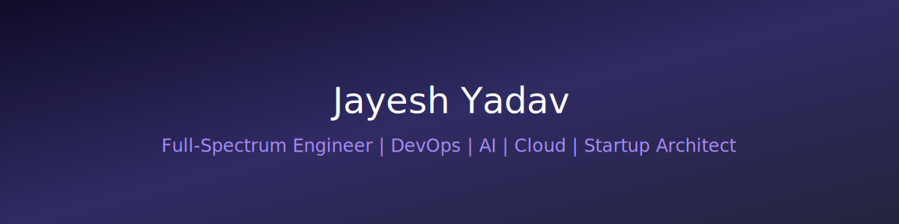

  

<!-- Animated Typing Header -->
<h1 align="center">
  
</h1>

  <b>Software Architect • DevOps Engineer • AI/ML Developer • Cloud Specialist • Growth Systems Builder</b>

---

# 🧠 Executive Summary

I design and build **scalable, production-grade digital ecosystems**.

I operate across:

• Full-Stack Engineering  
• DevOps & Cloud Infrastructure  
• AI / ML Systems  
• Automation Architecture  
• Performance Engineering  
• Revenue-Driven Digital Systems  

I don’t build projects.

I build **assets that scale, automate, and generate impact.**

---

# 🏗 Core Expertise

## 💻 Full-Stack Architecture
- React / Next.js
- Node.js / Express
- Python / FastAPI
- Java / Spring
- REST & GraphQL
- Microservices
- Monorepo architecture

## ☁ Cloud & DevOps Engineering
- AWS
- Docker & Containerization
- CI/CD (GitHub Actions)
- Infrastructure Automation
- Reverse Proxy (Nginx)
- Linux Server Hardening
- Performance Scaling

## 🤖 AI / ML & Intelligent Systems
- Python (Data & ML stack)
- Scikit-Learn
- TensorFlow / PyTorch
- Model Deployment APIs
- Automation Bots
- Data Pipelines
- Predictive Analytics

## ⚡ Performance & SEO Engineering
- Core Web Vitals Optimization
- Technical SEO
- Conversion Systems
- Growth Analytics
- Revenue Optimization Architecture

---

# 🚀 Founder & Builder Mindset

I approach engineering from a **product & business perspective**.

✔ Systems Thinking  
✔ Scalability First  
✔ Automation by Default  
✔ Performance Obsessed  
✔ ROI-Oriented Engineering  

---

# 📊 GitHub Intelligence

  
  

  

---

# 🧩 Strategic Focus (2026)

• AI-powered SaaS Systems  
• Cloud-native Infrastructure  
• Intelligent Automation  
• Startup-Grade Architectures  
• High-Ticket Digital Consulting  

---

# 🌐 Work With Me

I collaborate on:

• Premium freelance projects  
• Startup tech architecture  
• AI-based system development  
• DevOps modernization  
• Growth & performance optimization  

📩 Open for consulting & strategic builds.

> “Build once. Scale infinitely. Optimize continuously.”

---

# 💼 For Founders & Businesses

If you're building a product, scaling a startup, or modernizing infrastructure — I help you design and deploy:

• Scalable full-stack applications  
• Cloud-native infrastructure  
• AI-powered automation systems  
• High-performance websites that convert  

I combine engineering + growth strategy to build systems that:
✔ Increase revenue  
✔ Reduce operational friction  
✔ Scale without breaking  
✔ Perform under pressure  

# 🏢 Product Engineering Focus

• Scalable distributed systems  
• Backend optimization  
• API design best practices  
• Observability & monitoring  
• System reliability engineering  
• Performance benchmarking  
• Production deployment workflows  

# 🤖 AI & Research Interests

• Applied Machine Learning  
• Model Optimization  
• Deployment at Scale  
• Intelligent Automation  
• Data-driven system design  
• Real-world AI integration  

Exploring the intersection of:
AI × Automation × Infrastructure
